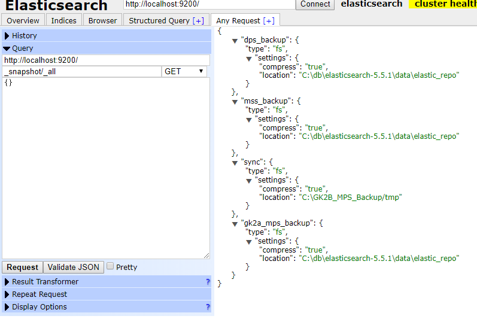

# ElasticSearch snapshot 백업/적용 방법

## Backup 방법

- 절차

  1. 스냅샷 ID를 생성해줌

     ```perl
     $response = $browser->put(
     	"http://$dbIP/_snapshot/mss_backup",
     	'Content-type' => 'application/json',
     	'content' => '{
     					"type": "fs",
     					"settings": {
     					  "compress": true,
     					  "location": "D:\\\\db\\\\elasticsearch-5.5.1\\\\data\\\\elastic_repo"
     					}
     				}'
     	);
     ```

  2. Backup 요청을 보냄

     ```perl
     $response = $browser->put(
     	# mss_tp_data는 스냅샷 인덱스를 의미
     	"http://$dbIP/_snapshot/mss_backup/mss_tp_data?wait_for_completion=true",
     	'Content-type' => 'application/json',
     	'content' => '{
     					"indices": [
     					"gk2b_mss_operation_hardware",
     					"gk2b_mss_operation_operator",
     					"gk2b_mss_operation_cotsversion",
     					"gk2b_mss_operation_version",		
     					"gk2b_mss_operation_statistics"		
     						],
     					"ignore_unavailable": true,
     					"include_global_state": true
     				}'
     	);
     
     ```

## Restore 방법

- 절차

  1. 기존의 DB data를 날려버리고 새로운 DB data를 copy 시킴
  2. 스냅샷 ID를 생성해줌 (Backup과 동일)

  3. DB data에서 원하는 index를 restore 함

     ```perl
     $response = $browser->post(
     	# mss_tp_data는 스냅샷 인덱스를 의미
     	"http://$dbIP/_snapshot/mss_backup/mss_tp_data/_restore",
     	'Content-type' => 'application/json',
     	'content' => '{
     					"indices": [
     					"gk2a_mss_*"
     						],
     					 "index_settings": {
     						"index.number_of_replicas": 0
     					  },
     					  "ignore_index_settings": [
     						"index.refresh_interval"
     					  ]
     				}'
     	);
     
     ```

## 그 밖의 팁들

### DB 의 스냅샷 ID를 확인하는 방법

```perl
$response = $browser->get(
	"http://$dbIP/_snapshot",
	'Content-type' => 'application/json',
	'content' => '{ }'
	);
```

- browser를 활용하면 편함

****

### Backup된 스냅샷 ID를 확인하는 방법

- index-0 파일을 열어보면 적혀 있음


## 참고

- [http://tech.javacafe.io/2017/12/08/Elasticsearch_Snapshot_%EB%A7%8C%EB%93%A4%EA%B8%B0/](http://tech.javacafe.io/2017/12/08/Elasticsearch_Snapshot_만들기/)


