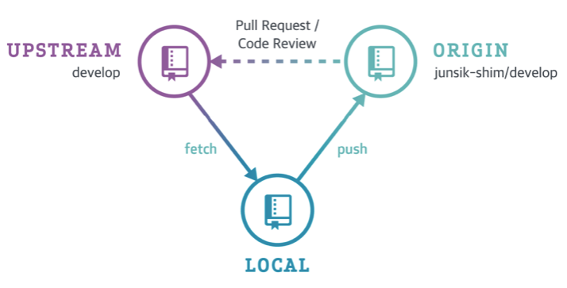
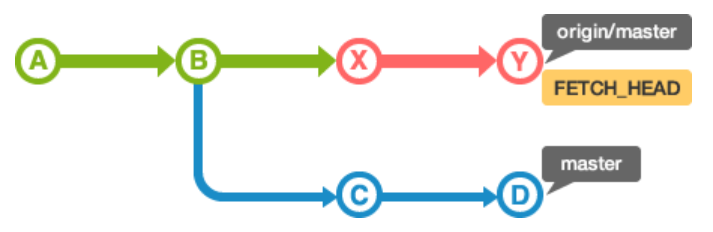
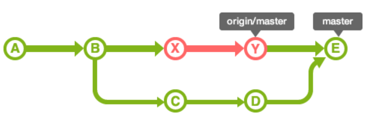

# git-training

### 실습

- https://github.com/rlawlstjd0077/git-training

### 알게 된 점

- 보통 Github으로 협업을 하는 경우 팀 repo를 fork 하여 작업 하는 것으로 보인다. (fetch를 upstream으로 부터 하는게 신기하군)

  - upstream - 공용 repository (보통 팀 repo)
  - origin - 공용 repository를 본인 계정으로 fork한 repository

  

- git fetch

  - pull VS fetch

    - pull을 실행하면, 원격 저장소의 내용을 가져와 자동으로 병합 작업을 실행하게 된다.
      - **실질적으로 pull은 내부에서는 fetch + merge로 동작하므로 둘은 동일한 동작으로 볼 수 있음**
    - fetch를 실행하면 단순히 원격 저장소의 내용을 확인만 하고 로컬 데이터와 병합은 하고 싶지 않은 경우에 사용할 수 있다.

  - fetch 동작 방식

    - fetch를 실행하면 원격 저장소의 최신 이력을 확인할 수 있고 이때 가져온 최신 커밋 이력은 이름 없는 브랜치로 로컬에 가져오게 된다.

      - 이 브랜치는 'FETCH_HEAD'의 이름으로 체크아웃할 수 있음

    - 원격/로컬 저장소가 B 커밋인 상태에서 fetch를 수행하면 아래 그림과 같이 이력이 남겨진다.

      

    - 그 상태에서 로컬의 master로 반영을 하고 싶다면 'FETCH_HEAD' 를 merge 하거나 pull을 수행하면 된다.

      

- 커밋시에 -m 은 사용하지 않도록 권장한다. (-m은 안티패턴임)

  - git commit 명령을 입력하면 커밋 메시지 편집기로 커밋 메시지를 작성하게 된다.
    - 기본은 Vi 에디터이며 편집기를 바꾸는 명령은 `git config --local core.editor notepad` 임
    - commit 메시지 편집을 생략하고 한 줄로 간단하게 작성할 경우에는 -m 옵션을 사용한다 (이제까지 모르고 썼었네 .. )