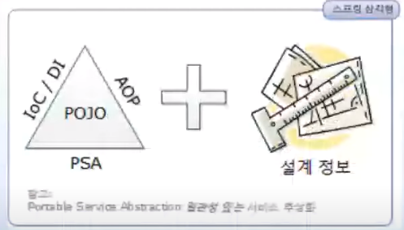

# 스프링 삼각형과 설정 정보

- 티끌 모아 태산 = 천리도 한 걸음 부터 라는 개념이 적용된다.
- 스프링이라고 하는 거대한 프레임워크는 스프링 삼각형과 설정 정보를 안다면 다 아는 것이다.
  - 이걸 알만 학습이 완만해질 수 있음
- 프로그래머 3대 스킬
  - C&P - Copy Understand Paste
  - D&C - Divide Think Conquer - 분할 하고 생각(TDD)하고 정복해라
  - Creative Idleness - 창조적 게으름

### 스프링 삼각형



시작인 동시에 완성

- DI - 의존성 주입
- AOP - 관점 지향 프로그래밍
- PSA - 일관성 있는 서비스 추상화

### 설정 정보

- 아래 것들을 조합해서 사용하는 것을 추천

- 단순하게 의존성은 new 이다.

  - 프로그래밍에서 의존 관계는 new 로 표현

- XML 기반(처음에는 한번 설정 해보고 이해해볼 필요가 있음)

  https://expert0226.tistory.com/193?category=479268

  - 실생활에서의 의존성은 아래와 가깝다.

  ```java
  운전자가 종합 쇼핑몰에서 타이어를 구매한다.
  운전자가 종합 쇼핑몰 자동차에 타이어를 구매한다.
  운전자가 자동차에 타이어를 장착한다.
  ```

  - 종합 쇼핑몰 = 스프링 프레임 워크 라고 볼 수 있다.

  ```java
  //쇼핑몰 세우기 (expert.xml는 물품 목록 (?))
  ApplicationContext context = new FileSystemXmlApplicationcontext("/src/main/java/expert002/expert.xml");
  //구매
  Tire tire = (Tire)context.getBean("tire");
  //구매
  Car car = (Car)context.getBean("car");
  //장착
  car.setTire(tire);
  ```

  - 좀 더 쇼핑몰에서 해주도록 해보자.

  ```java
  운전자가 종합 쇼핑몰에서 자동차를 구매 요청한다.
  종합 쇼핑몰은 자동차를 생산한다.
  종합 쇼핑몰은 타이어를 생산한다.
  종합 쇼핑몰은 자동차에 타이어를 장착한다.
  종합 쇼핑몰은 운전자에게 자동차를 전달한다.
  ```

  - 코드는 바꿀 필요가 없다.

  ```java
  ApplicationContext context = new FileSystemXmlApplicationContext("/src/main/java/expert003/expert.xml");
  Car car = (Car)context.getBean("car");
  
  //expert.xml
  <bean id="koreaTire" class="expert003.KoreaTire"></bean>
  <bean id="americaTire" class="expert003.AmericaTire"></bean>
  <bean id="car" class="expert003.Car">
         <property name="tire" ref="koreaTire"></property>
  </bean>
  ```

- @ 기반

  - Component Scan
  - Annotation Driven

  ```java
  운전자가 종합 쇼핑몰에서 자동차를 구매 요청한다.
  종합 쇼핑몰은 자동차를 생산한다.
  종합 쇼핑몰은 타이어를 생산한다.
  종합 쇼핑몰은 자동차에 타이어를 장착한다.
  종합 쇼핑몰은 운전자에게 자동차를 전달한다.
  ```

  ```java
  <?xml version="1.0" encoding="UTF-8"?>
  <beans xmlns="<http://www.springframework.org/schema/beans>"
   xmlns:xsi="<http://www.w3.org/2001/XMLSchema-instance>"
   xmlns:context="<http://www.springframework.org/schema/context>"
   xsi:schemaLocation="<http://www.springframework.org/schema/beans>
    <http://www.springframework.org/schema/beans/spring-beans.xsd>
    <http://www.springframework.org/schema/context>
    <http://www.springframework.org/schema/context/spring-context-3.1.xsd>">
  
   <context:annotation-config />
  
   <bean id="tire" class="expert004.KoreaTire"></bean>
  
   <bean id="americaTire" class="expert004.AmericaTire"></bean>
  
   <bean id="car" class="expert004.Car"></bean>
  
  </beans>
  ```

- Java Config 기반

- Groovy Config 기반

- 다양한 방법으로 원하는 만큼 재정의 해서 사용 가능

## AOP

- 스프링 DI가 의존성(new)에 대한 주입이라면, 스프링 AOP는 로직(code) 주입이라고 볼 수 있다.
  - 프록시 패턴 기반이다.
- 코드 = 핵심관심사항 + 횡단관심사항
- 스프링이 제공하는 AOP는 기본설정인 경우 interface를 기반으로하는 JDK 다이나믹 Proxy를 이용한다.
- Before, After (AfterReturning, AfterException) 애노 테이션을 통해서 만들며 런타임에 로직이 주입된다.

### PSA

- 기법이며 구현체를 Spring Team에서 적극적으로 지원하고 있다.
- OXM (Object XML Mapper)
  - Castor XML - Adapter Pattern
  - JiBX - Adapter
  - XmlBeans - Adapter
  - Xstream - Adapter

### 웹의 독수리 5형제

- Request - 사용자가 브라우저를 통해서 요청한 것
- Response - 서버가 사용자에게 응답하는 것
- Cookie - 브라우저 쪽에 남겨놓는 과자 쪼가리
- Session - 접소한 사용자별의 메모리 공간
- Applicaiton - 접속한 모든 사용자들에게 공유되는 공유변수