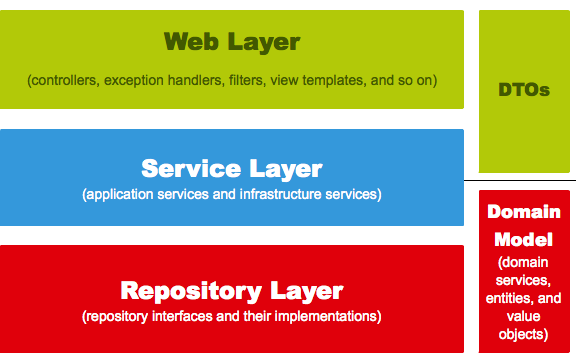
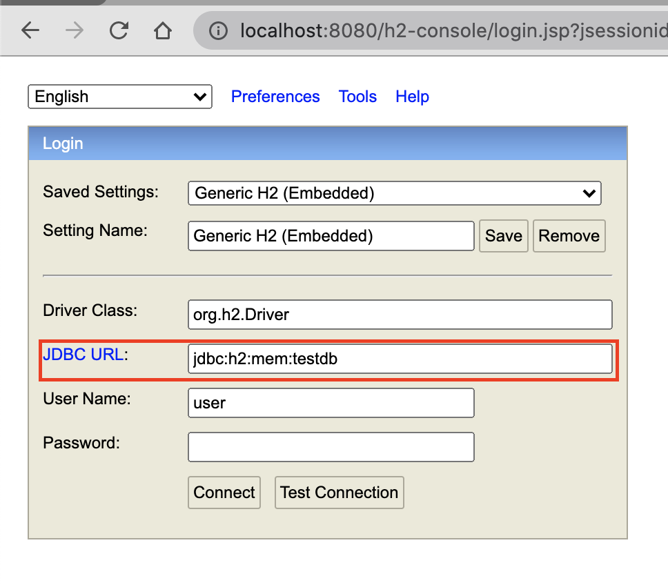
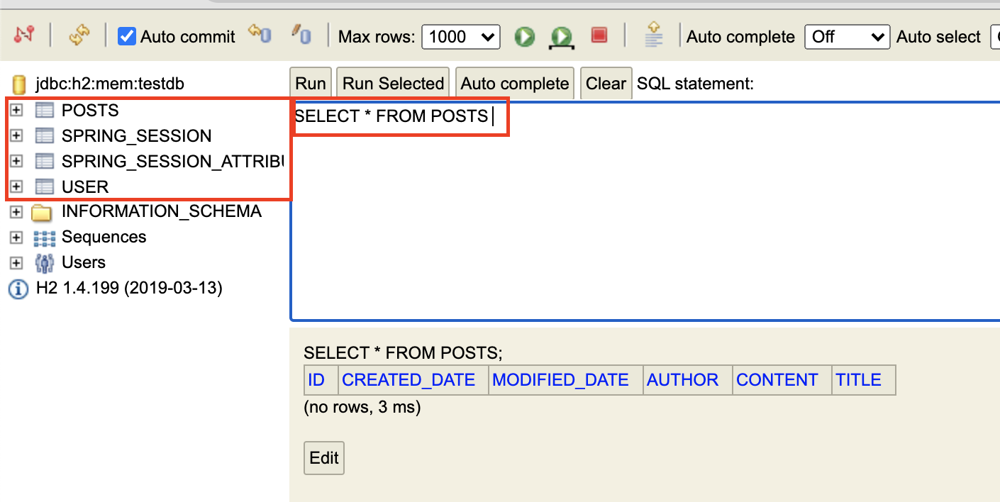

## JPA란?

- 기존에 SQL을 피할 수 없었던 문제
  - 데이터베이스에 저장, 조회하려면 필수적이었음
  - 패러다임 불일치
- 객체지향 프로그래밍 언어와 관계형 데이터베이스 중간에서 패러다임 일치를 시켜 주기 위한 기술

## Spring Data JPA

- JPA는 인터페이스로서 자바 표준명세서
  - 구현체가 필요함
- 구현체는 JPA ← Hibernate ← Spring Data JPA
  - Hibernate, Spring Data
- 아래의 장점
  - 구현체 교체의 용이성
    - 구현체 매핑을 지원
  - 저장소 교체의 용이성
    - DB의 기능은 같으니 다른 DB로 대체 가능
- Spring Data의 하위 프로젝트들은 기본적인 CRUD 인터페이스가 같기 때문이다.
  - 그래서 Hibernate를 직접 쓰기 보다는 Spring Data 프로젝트를 권장함

## 프로젝트에 Spring Data JPA 적용하기

- Entity 클래스에는 절대 Setter 메소드를 만들지 않음
  - 정 필요하다면 명확히 목적, 의도를 나타낼 수 있는 메소드를 추가해주는 것이 좋음
- JPARepository는 DB Layer 접근자
  - JPARepository<Entity 클래스, PK타입>을 선언하면 CRUD 메소드가 자동으로 생성됨

## Spring Data JPA테스트 코드 작성하기

- 실제로 실행된 쿼리는 볼수있다.

  - application.properties, application.yml등의 파일로 한줄의 코드로 설정 가능

  ```java
  spring.jpa.show_sql = true
  ```

## 등록/수정/조회 API 만들기

- 이를 처리하기 위해선 3개의 클래스가 필요

  - Request 데이터를 받을 DTO

  - API 요청을 받을 Controller

  - 트랜잭션, 도메인 기능 간의 순서를 보장

    하는 Service

    - Service는 비즈니스 로직을 처리해야 하지만은 않는다.

### 스프링 웹 계층

- Web Layer
  - 흔히 사용되는 컨트롤러, JSP등의 뷰 템플릿 영역
  - 외부 요청과 응답에 대한 전반적인 영역을 이야기
- Service Layer
  - @Service에 사용되는 서비스 영역
  - 일반적으로 Controller와 Dao의 중간 영역에서 사용됨
  - @Transaction이 사용되어야 하는 영역이기도 함
- Repository Layer
  - Database와 같이 데이터 저장소에 접근하는 역할
  - ibatis나 MyBatis 등에서 Dao라고 불리는 DB Layer 접근자이다.
- DTOs
  - 계층간에 데이터 교환을 위한 객체를 이야기함
  - 뷰 템플릿 엔진에서 사용될 객체나 Repository Layer에서 결과로 넘어온 객체등이 이들을 이야기함
- Domain Model
  - 도메인이라 불리는 개발 대상을 모든 사람이 동일한 관점에서 이해할 수 있고 공유할 수 있도록 단순화시킨 것을 도메인 모델이라고 함



### Service의 역할

- 기존에 서비스로 처리하던 방식을 트랜잭션 스크립트라고 함

  - 모든 로직이 서비스 클래스 내부에서 처리됨
  - 그렇게 되면서 객체란 단순한 데이터 덩어리 역할만 하게 됨

- 반면 도메인 모델에서 처리하게 되면

  - 도메인 모델에서 본인의 이벤트를 처리하게 되고
  - 서비스 메소드는 **트랜잭션과 도메인간의 순서만 보장해 줌**

  ```java
  @Transactional 
  public Order cancelOrder(int orderId) {
  	Order order = orderReporitory.findById(orderId);
  	Billing billing = billingRepository.findById(orderId);
  	Delivery delivery = deliveryRepository.findByOrderId(orderId);
  
  	delivery.cancel();
  	order.cancel();
  	billing.cancel();
  
  	return order;
  ```

- 롬복 생성자를 통하면 생성자를 수정할 필요가 전혀 없는 이점이 있음

### DTO, Entity를 분리해야 하는 이유

- Dto클래스가 Entity 클래스와 거의 유사해보이지만 절대로 Entity클래스를 Request/Res 클래스로 사용해서는 안됨

  - Entity클래스는 DB와 맞닿은 핵심 클래스이기 때문에 이를 기준으로 테이블이 생성되고, 스키마가 변경됨
    - 즉, Dto는 Vierw를 위한 클래스이기에 잦은 변경이 필수적임
  - 그렇기 때문에 **View Layer와 DB Layer의 역할 분리를 철저하게 하는 것이 좋음**

- update기능의 경우 DB에 쿼리를 날리는 부분이 없는데 그 이유는 

  JPA의 영속성 컨텍스트 때문

  - JPA의 엔티티 매니저가 활성화된 상태로(Spring Data Jpa를 쓴다면 기본) 트랜잭션 안에서 DB에서 가져오면 그 데이터는 영속성 컨테스트가 유지된 상태임
  - 이 상태에서 해당 데이터의 값을 변경하면 **트랜잭션이 끝나는 시점에 해당 테이블에 변경분을 반영함**
  - 이 개념을 더디체킹 이라함 (https://jojoldu.tistory.com/415)

## H2 데이터 베이스 접근을 위한 웹 콘솔 사용방법

1. [application.properties](http://application.properties) 에 웹 콘솔 옵션을 활성화 시키기

   - `spring.h2.console.enabled=true`

2. http://localhost:8080/h2-console 접속하여 웹 콘솔 화면 확인

   - `jdbc:h2:mem:testdb` 로 되어 있는지 확인

   

3. 좌측에는 테이블 목록이 있고 테이블 선택시에 Run 항목에서 쿼리를 날려볼 수도 있습니다.

   