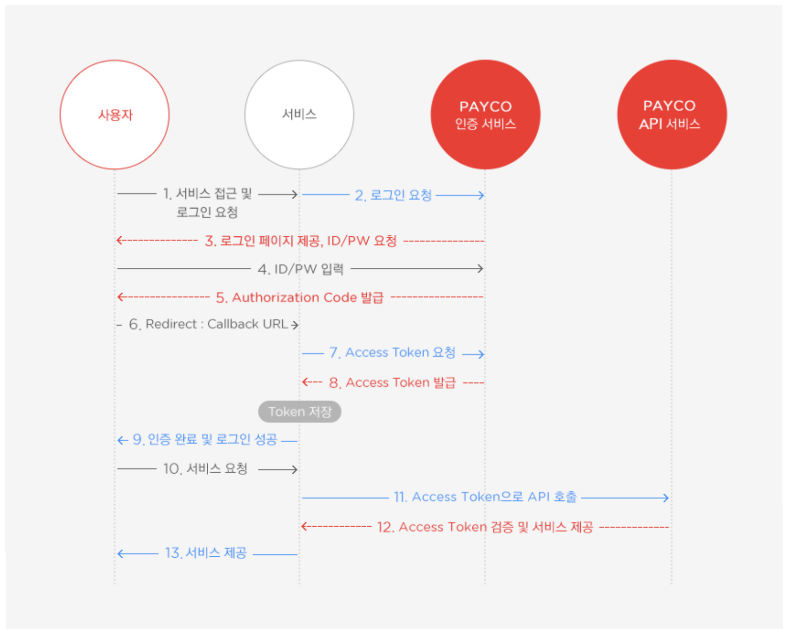

# Oauth2.0 동작 매커니즘

### OAuth란?

- OAuth 2.0은 다양한 플랫폼 환경에서 권한 부여를 위한 산업 표준 프로토콜입니다.
- 외부 서비스의 회원 정보를 안전하게 사용하기 위한 방법

### OAuth 주요 3요소.

- Client: 개발하는 웹/앱 서비스
- Resource Server: Google, Facebook 등 사용자의 Resource를 갖고 있는 서버
- Resource Owner: 사용자

## 전체적인 동작 순서

1. Client는 Resource Server에 서비스를 등록한다. (행정적인 절차)
2. Resource Server는 Client ID, Client Seceret 을 발급해준다.
3. Client 는 Resource Owner 에게 Resource Server 로 부터 어떤 정보를 사용하겠다는 동의를 받는다.
4. Client 는 Resource Server에 접속되어 로그인 창을 띄우고 Client 에서 정보를 사용한다는 동의를 받는다.
5. 로그인 후 Resource Server는 Client 에게 해당 Owner의 패스워드인 Code를 전달해준다.
6. Client는 Resource Server에게 Client ID, Client Seceret, Code 값을 전달한다.
7. Resource Server 는 해당 값을 보고 승인을 했던 Client ID, Client Seceret, Code 값이 맞는지 확인하여 유효하다면 Client에게 Access Token을 발급한다.
8. 이후에 Client는 Access Token을 잘 보관하여 Resource Server에게 Access Token을 이용하여 정보를 요청한다.

### Scope

- Client가 Resource Server에서 가져오고자 하는(필요한) 특정 데이터를 의미한다.
  - 예) Google의 Calendar 의 List를 가져오고자 할 때 List가 Scope을 의미함